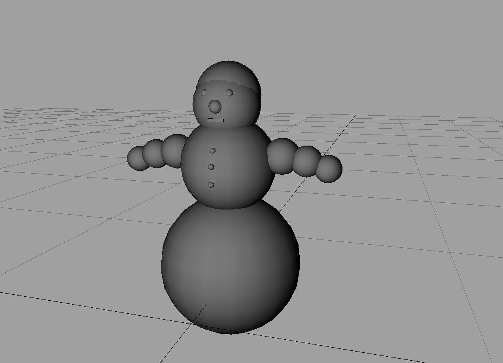

# Final Thesis Grammar School (*Facharbeit*)

An editor and live simulation of electro-magnetic dynamics from 2007.

The final [script](./Skript/Facharbeit.pdf)

## Rutherford scattering

## Electron gun

## Electron circling around a Proton

## After a long time...

## Wien filter

## Some fields

Legend: green: gravity, blue magnetic, red: electric

## Load distribution

## Tooling

## Modeling

## Snowman

